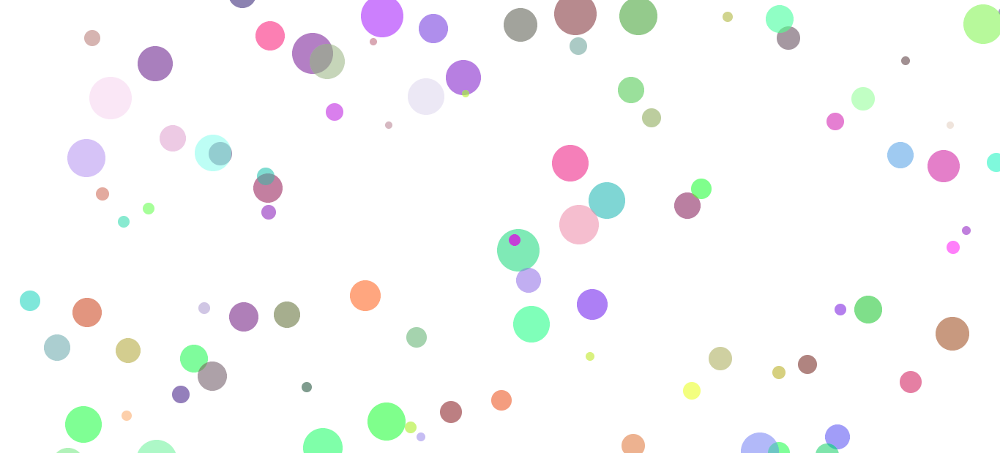
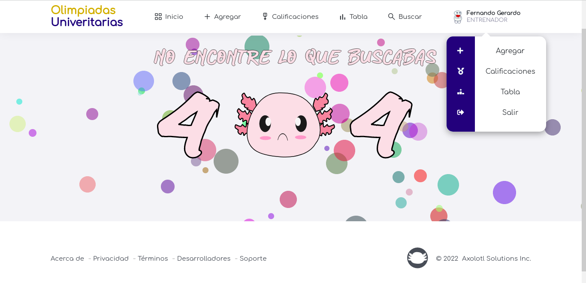

# BubblesParticlesJavasript
Script generate  particles from bottom to top with random colors, and mousemove event that generate particles on (x,y) mouse coordinates.

## Implemented on a web page.

