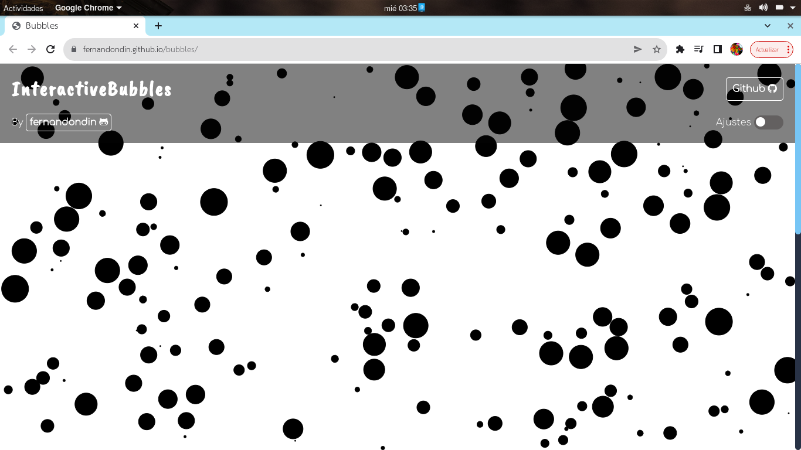
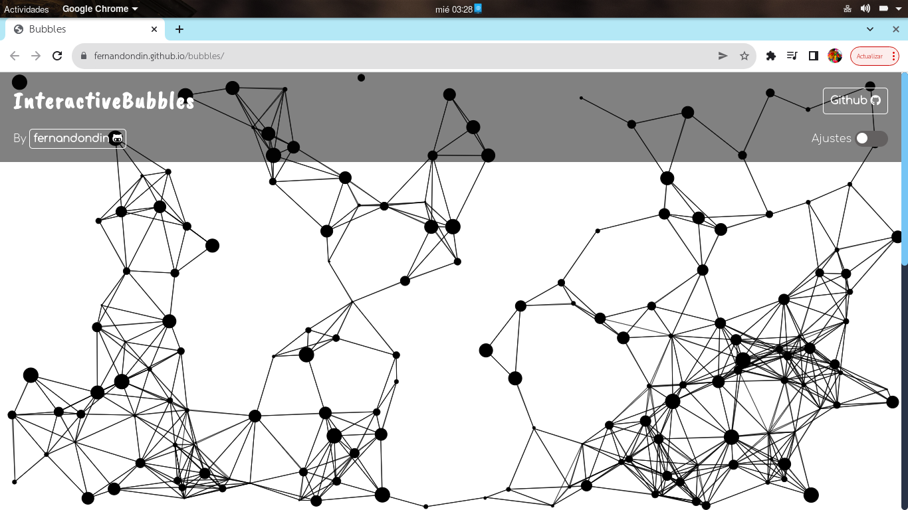
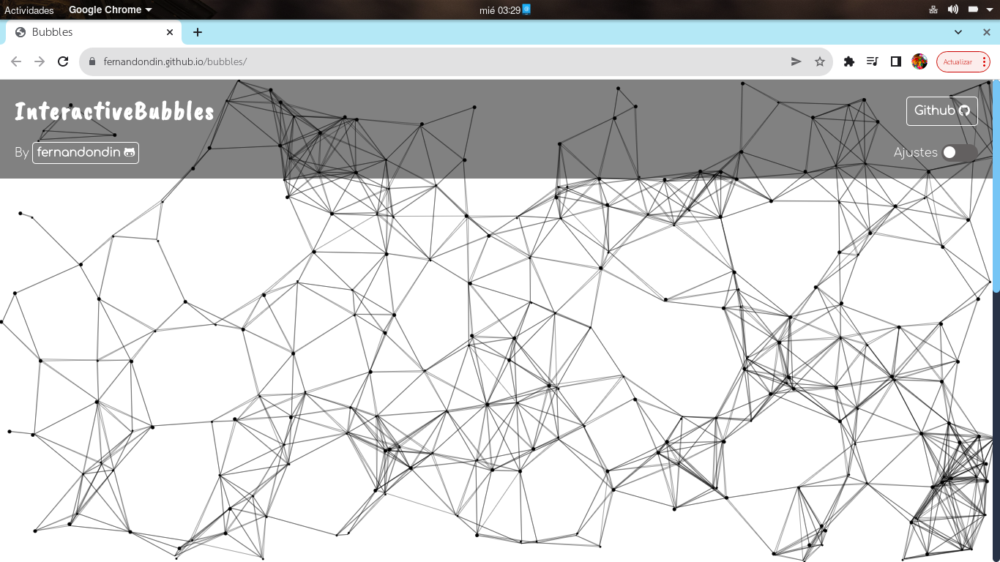
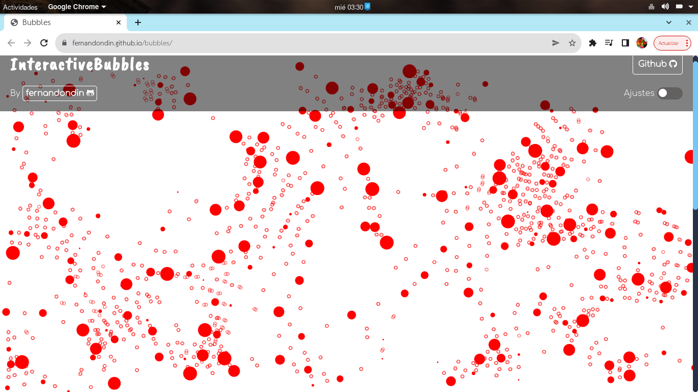
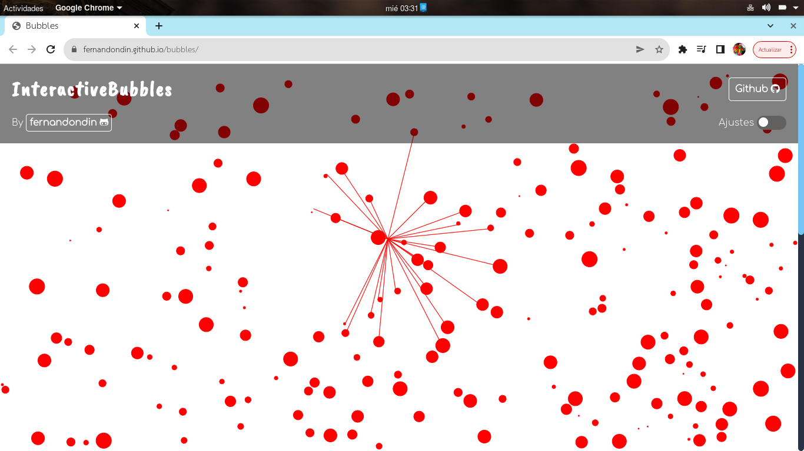
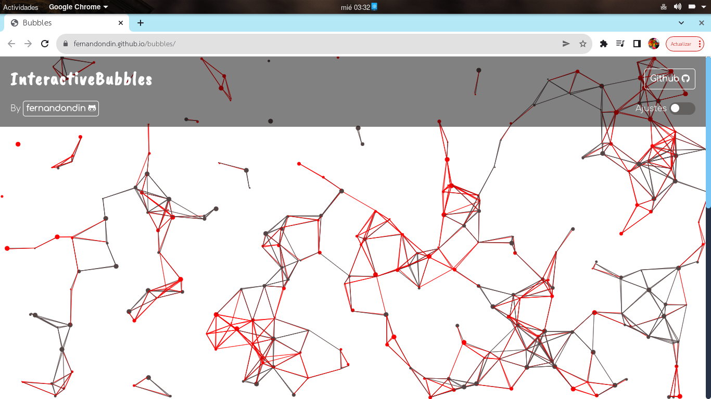
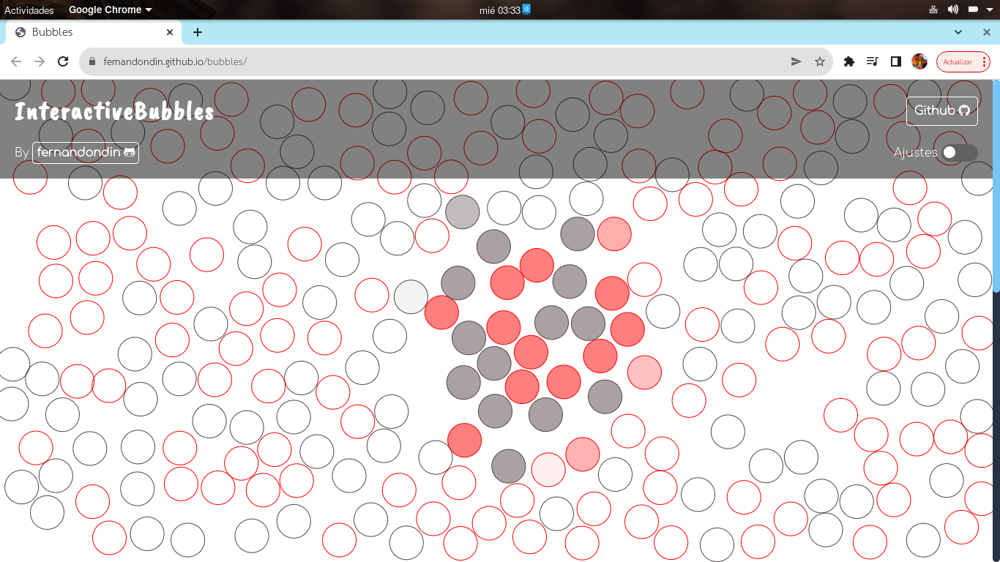
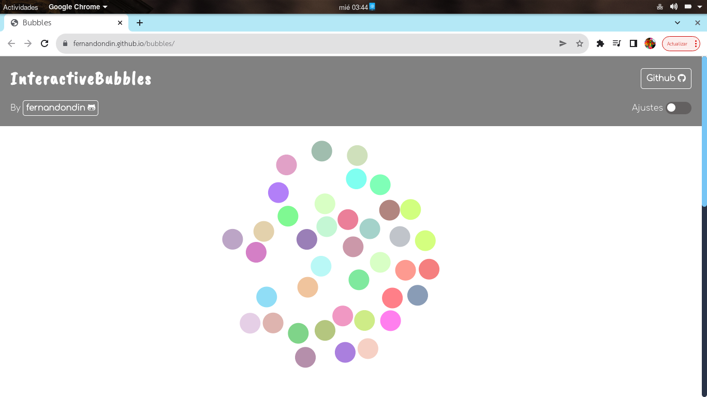

# Interactive Bubbles
Script generate "bubbles" which can be modified to get awesome effects, the bubbles can colide, randomize their size and a lot of thigs that you can checkout on the webpage [https://fernandondin.github.io/bubbles/](https://fernandondin.github.io/bubbles/)

You can get some beautiful effects like this:

##Simple bubbles

##Play with bubbles fill

##Connect the bubbles with a line, circle or both

##Change width conection and size of bubbles

##Change color of the bubbles and the connection

##Mouse interact with the connection between the bubbles

##Use as many color as you want

##Mouse interact with bubbles fill

##Change opacity of circunference and have this awesome onmouse show effect

